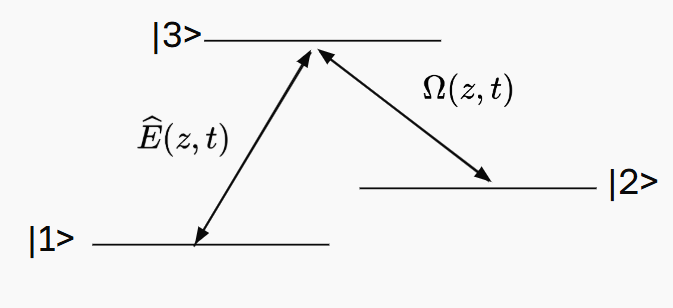
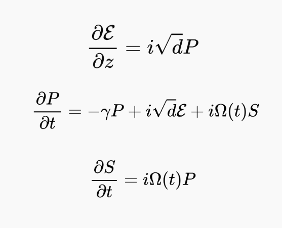
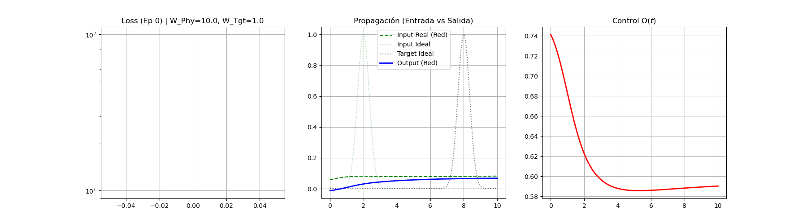
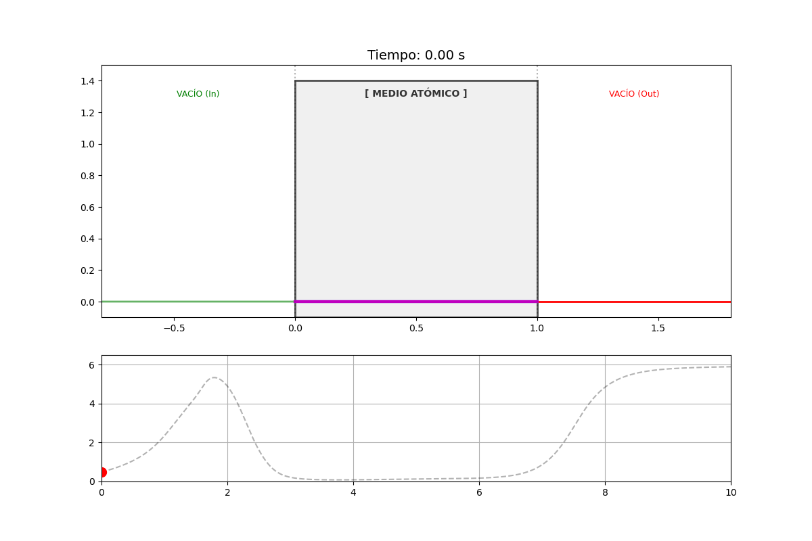

# Physics-Informed Neural Networks (PINN) for Quantum Memory Control

This repository demonstrates the development and deployment of a **Physics-Informed Neural Network (PINN)** using PyTorch, accelerated via CUDA. The objective is to solve a complex system of coupled Partial Differential Equations (PDEs) to optimize the storage and retrieval of light in a quantum memory system (Dark-State Polaritons).

##  Project Overview: AI Meets Quantum Physics

Traditional numerical solvers (like Finite Element or Finite Difference Methods) rely on discretizing space and time. In this project, a deep neural network is trained to act as a universal function approximator that strictly obeys the laws of physics. 

The PINN continuously minimizes a custom loss function defined by the PDE residuals of the physical system, effectively "learning" the physics to generate the optimal control laser pulse ($\Omega(t)$).

### 1. The Physical System

*Figure 1: Energy level diagram of the atomic medium. The system relies on Electromagnetically Induced Transparency (EIT) to map a quantum state of light ($\mathcal{E}$) into a long-lived atomic spin wave ($S$) using an external classical control field ($\Omega$).*

### 2. The Governing Equations (Gorshkov PDEs)

*Figure 2: The non-linear, coupled partial differential equations governing the propagation of light, atomic coherence, and the spin wave. The PINN calculates the automatic differentiation (`torch.autograd`) of these exact equations to compute the physics-loss.*

##  Machine Learning Architecture & Training

The architecture consists of two parallel Fully Connected Neural Networks (`Net_Fields` and `Net_Control`) utilizing `Tanh` activation functions to guarantee continuous, differentiable outputs.

### Curriculum Learning Implementation
Training a PINN on highly dynamic systems often leads to gradient vanishing or local minima. To solve this, a **Curriculum Learning** strategy was implemented:
1.  **Phase 1 (Basic Physics):** The network focuses heavily on minimizing boundary/initial conditions and basic PDE residuals.
2.  **Phase 2 & 3 (Fine Optimization):** The weight of the "Target Objective" (the desired output pulse shape) is dynamically increased over thousands of epochs.

*Animation 1: Real-time visualization of the training process. The network dynamically adjusts the control field $\Omega(t)$ (red curve) until the physical output perfectly matches the target waveform.*

##  Numerical Audit & Validation

To ensure the AI's predictions are physically sound and not just numerical artifacts, the PINN's output control field was extracted and fed into a traditional Finite Difference numerical solver built from scratch in Python.

*Animation 2: Independent numerical simulation acting as an audit. The simulation proves that injecting the AI-generated control field into the atomic medium successfully stops the light pulse, stores it as a spin wave (magenta), and retrieves it with a high efficiency.*

### Final Audit Results
* **Theoretical Maximum Efficiency:** 90.33%
* **PINN Achieved Efficiency:** ~94.28% *(Note: Slight variances occur due to discrete integration steps vs. continuous analytical limits).*

##  Industrial & R&D Applications

While applied here to quantum optics, the methodology of using PINNs is actively revolutionizing modern engineering. This project demonstrates highly transferable skills:
* **Custom AI Architectures:** Building non-standard loss functions beyond simple MSE/Cross-Entropy.
* **Solving Complex PDEs:** Replacing computationally expensive fluid dynamics (CFD) or heat transfer simulations with fast-inference neural networks.
* **Hardware Acceleration:** Utilizing CUDA architectures for high-performance tensor computing.
